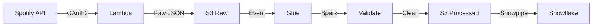

# 🎧 Spotify ETL Pipeline with AWS Lambda, Glue & Snowflake

## 📌 Project Overview

This project implements an **end-to-end ETL (Extract, Transform, Load) pipeline** using **AWS serverless services** to ingest music data from the **Spotify Web API**, process it using **Apache Spark on AWS Glue**, and store analytics-ready datasets for querying in **Snowflake or Amazon Athena**.

The pipeline follows **real-world data engineering best practices**, including:
- API-based ingestion
- Raw and transformed data separation
- Scalable Spark transformations
- Normalized dimensional data modeling

---

## 🏗️ Architecture Overview



---

## 🛠️ Tech Stack

| Layer | Technology |
|-----|-----------|
| Data Source | Spotify Web API |
| Extraction | AWS Lambda (Python) |
| Storage | Amazon S3 |
| Processing | AWS Glue (PySpark) |
| Orchestration | Event-based / Scheduler |
| Data Format | JSON → CSV / Parquet |
| Analytics | Snowflake / Athena |

---

## 📂 Project Structure
``` text
Spotify-ETL-Pipeline/
│
├── lambda/
│ └── spotify_extract_lambda.py
│
├── glue/
│ └── spotify_transformation_job.py
│
├── s3/
│ ├── raw_data/
│ │ └── to_processed/
│ └── transformed_data/
│ ├── album/
│ ├── artist/
│ └── songs/
│
└── README.md
```


---

## 🔄 End-to-End ETL Workflow (Step-by-Step)

### Step 1: Configure Spotify API Credentials

- Create a Spotify Developer account
- Generate:
  - Client ID
  - Client Secret

Set the credentials as **AWS Lambda environment variables**:


This avoids hardcoding secrets and follows security best practices.

---

### Step 2: Extract Data Using AWS Lambda

- AWS Lambda uses the **Spotipy SDK** to connect to the Spotify API
- Fetches playlist track data using a playlist URI
- Stores the response as **raw JSON** in Amazon S3

**S3 Raw Data Location**
``` text
s3://spotify-etl-project-hanumant/raw_data/to_processed/
```

Each Lambda execution creates a **timestamped JSON file**, enabling reprocessing.

---

### Step 3: Verify Raw Data in Amazon S3

Before running AWS Glue:
- Confirm raw JSON files exist in the S3 raw zone
- Ensure Lambda execution completed successfully

Example:
``` text
spotify_raw_20260106_104530.json
```
---

### Step 4: Transform Data Using AWS Glue (PySpark)

- AWS Glue reads raw JSON files from S3
- Converts DynamicFrames to Spark DataFrames
- Performs Spark-based transformations

**Transformations include:**
- Exploding nested JSON structures
- Deduplicating records using primary keys
- Normalizing data into dimensional tables
- Converting date fields

**Output Tables:**
- Albums
- Artists
- Songs

**Glue Input Path**
``` text
s3://spotify-etl-project-hanumant/raw_data/to_processed/
```

---

### Step 5: Load Transformed Data Back to S3

Transformed datasets are written to the curated zone in S3.

**S3 Transformed Data Location**
``` text
s3://spotify-etl-project-hanumant/transformed_data/
```


### Folder structure:
``` text
transformed_data/
├── album/
├── artist/
└── songs/
```

---

### Step 6: Query Data for Analytics

The transformed data can be queried using:
- Amazon Athena
- Snowflake
- BI tools (Tableau, Power BI)

---


---

## 📊 Sample S3 Output

```text
s3://spotify-etl-project-hanumant/transformed_data/
├── album/
│ └── album_transformed_2026-01-06/
├── artist/
│ └── artist_transformed_2026-01-06/
└── songs/
└── songs_transformed_2026-01-06/
```


---


## ❄️ Step 7: Load Transformed Data into Snowflake Using Snowpipe

After the transformed data is available in Amazon S3, it is loaded into Snowflake using Snowpipe for secure, automated, near real-time ingestion.

---

## 🔐 Snowflake Integration Overview
``` text
**Flow:**
Amazon S3 (Transformed Data)
|
| (Event Notification)
v
Snowpipe
|
v
Snowflake Tables

```


---
## 🔐 Step 7.1: Create IAM Role for Snowflake (AWS Side)

Create an IAM Role in AWS with the following permissions:

IAM Policy
``` text
{
  "Version": "2012-10-17",
  "Statement": [
    {
      "Effect": "Allow",
      "Action": [
        "s3:GetObject",
        "s3:GetObjectVersion",
        "s3:ListBucket"
      ],
      "Resource": [
        "arn:aws:s3:::spotify-etl-project-hanumant",
        "arn:aws:s3:::spotify-etl-project-hanumant/*"
      ]
    }
  ]
}
```


## 🔗 Step 7.2: Create Storage Integration in Snowflake

Create a Snowflake Storage Integration that connects Snowflake to the AWS IAM Role.

``` sql 
CREATE OR REPLACE STORAGE INTEGRATION spotify_s3_integration
TYPE = EXTERNAL_STAGE
STORAGE_PROVIDER = S3
ENABLED = TRUE
STORAGE_AWS_ROLE_ARN = 'arn:aws:iam::<AWS_ACCOUNT_ID>:role/<SNOWFLAKE_IAM_ROLE>'
STORAGE_ALLOWED_LOCATIONS = (
  's3://spotify-etl-project-hanumant/transformed_data/'
);
```

### Verify Integration
```
DESC STORAGE INTEGRATION spotify_s3_integration;
```
### This command returns:
- STORAGE_AWS_IAM_USER_ARN
- STORAGE_AWS_EXTERNAL_ID


## 📦 Step 7.3: Create File Format in Snowflake

```sql
CREATE OR REPLACE FILE FORMAT spotify_csv_format
TYPE = 'CSV'
FIELD_DELIMITER = ','
SKIP_HEADER = 1
NULL_IF = ('NULL', 'null')
EMPTY_FIELD_AS_NULL = TRUE;
```
## Step 7.4: Create External Stage (S3 → Snowflake)
``` sql
CREATE OR REPLACE STAGE spotify_s3_stage
URL = 's3://spotify-etl-project-hanumant/transformed_data/'
CREDENTIALS = (
    AWS_KEY_ID = '<AWS_ACCESS_KEY>'
    AWS_SECRET_KEY = '<AWS_SECRET_KEY>'
)
FILE_FORMAT = spotify_csv_format;
```
🔐 Security Note:
In production, use IAM Role + Storage Integration instead of access keys.

 ## 🗄️ Step 7.5: Create Snowflake Tables
Albums Table
``` sql
CREATE OR REPLACE TABLE albums (
    album_id STRING,
    album_name STRING,
    release_date DATE,
    total_tracks INTEGER,
    url STRING
);
Artists Table
```
``` sql
CREATE OR REPLACE TABLE artists (
    artist_id STRING,
    artist_name STRING,
    external_url STRING
);
Songs Table
```
``` sql 
CREATE OR REPLACE TABLE songs (
    song_id STRING,
    song_name STRING,
    duration_ms INTEGER,
    popularity INTEGER,
    album_id STRING,
    artist_id STRING,
    song_added DATE,
    url STRING
);
```

 ## 🚀 Step 7.6: Create Snowpipe for Automated Loading
Albums Snowpipe
``` sql 
CREATE OR REPLACE PIPE album_pipe
AUTO_INGEST = TRUE
AS
COPY INTO albums
FROM @spotify_s3_stage/album/
FILE_FORMAT = spotify_csv_format;
Artists Snowpipe
```
```sql 
CREATE OR REPLACE PIPE artist_pipe
AUTO_INGEST = TRUE
AS
COPY INTO artists
FROM @spotify_s3_stage/artist/
FILE_FORMAT = spotify_csv_format;
Songs Snowpipe
```
``` sql 
CREATE OR REPLACE PIPE songs_pipe
AUTO_INGEST = TRUE
AS
COPY INTO songs
FROM @spotify_s3_stage/songs/
FILE_FORMAT = spotify_csv_format;
```
 ## 🔁 Step 7.7: Enable Auto-Ingestion (S3 Event Notification)
- Configure S3 Event Notifications
- Trigger Snowpipe when new files arrive
- Ensures near real-time ingestion

 ## 📊 Step 8: Query Data in Snowflake (Sample SQL Queries)
Total Songs per Artist
``` sql
SELECT artist_name, COUNT(*) AS total_songs
FROM songs s
JOIN artists a ON s.artist_id = a.artist_id
GROUP BY artist_name
ORDER BY total_songs DESC;
```
Top 10 Most Popular Songs
``` sql 
SELECT song_name, popularity
FROM songs
ORDER BY popularity DESC
LIMIT 10;
```
Albums Released Per Year
``` sql
SELECT YEAR(release_date) AS release_year, COUNT(*) AS total_albums
FROM albums
GROUP BY release_year
ORDER BY release_year;
```

## 🧠 Key Data Engineering Concepts Demonstrated

- Serverless ETL architecture
- API data ingestion
- Raw vs curated data zones
- Spark transformations using AWS Glue
- Schema normalization
- Deduplication strategies
- Cloud-native pipeline design

---


## 👨‍💻 Author

**Hanumant Nanasaheb Thakre**  
Aspiring Data Engineer  

**Skills:** Python, SQL, PySpark, AWS, Airflow, Kafka, Snowflake  

🔗 GitHub: https://github.com/thakare2912

---

